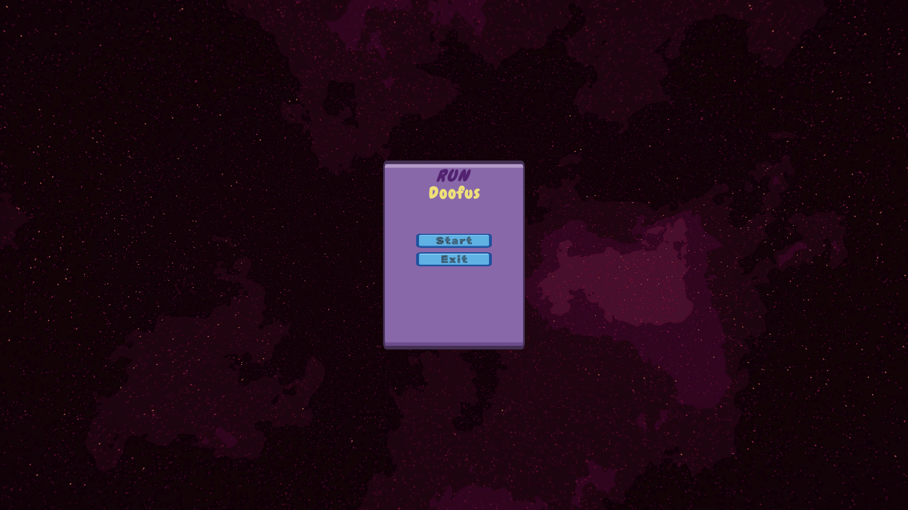
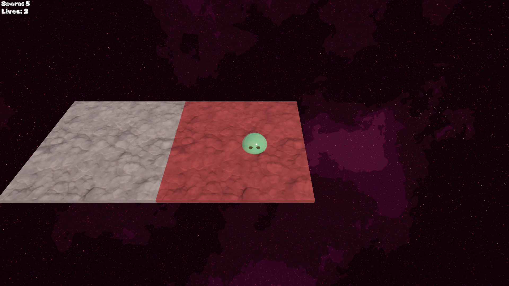
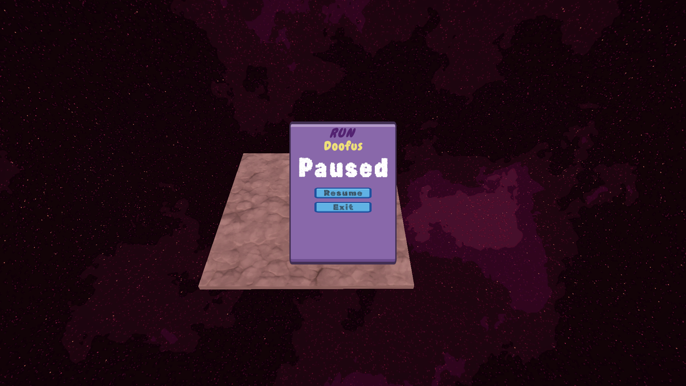
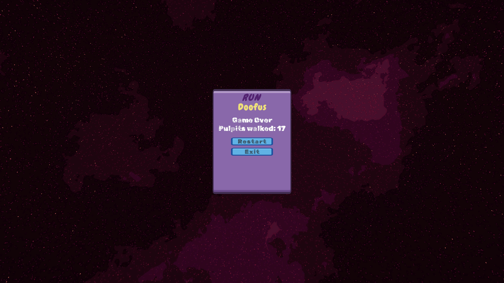

# Doofus Adventure Game

Submission for the **Hitwicket Game Developer Assignment (VIT 2026)**.

A Crossy-Road-style survival game: guide Doofus (a slime) across an endless,
disappearing chain of platforms ("Pulpits") for as long as you can.

**Author:** <your name>
**Engine:** Unity 6 (6000.x), Built-in Render Pipeline (URP shaders)
**Repo:** `HW_2026_Test`

---

## Gameplay preview

| Start | In-game | Paused | Game Over |
|---|---|---|---|
|  |  |  |  |

🎥 **Full gameplay recording:** [`Files/submission.mp4`](Files/submission.mp4)

---

## How to run

1. Open the project folder in Unity Hub (Unity 6+).
2. Open the main scene under `Assets/Scenes/`.
3. Press Play. Click **Start**, then use **WASD / Arrow keys** to move.
4. Press **Esc** at any time to pause/resume.

A standalone build can also be produced via `File → Build Settings → Build`
(see `GUIDE.md` for the full walkthrough).

---

## Controls

| Input | Action |
|---|---|
| `W` `A` `S` `D` or Arrow keys | Move Doofus |
| `Esc` | Pause / Resume |

Movement only — no jump, by design (matches the brief exactly).

---

## Features implemented

### Level 1 — Movement + JSON-driven Pulpit placement
- Doofus moves continuously in 4 directions at a speed read entirely from
  `doofus_diary.json` — nothing gameplay-related is hardcoded.
- Only **2 Pulpits** ever exist at once. A new one spawns adjacent to the
  active one once its remaining time drops to the JSON-configured
  threshold, and it's guaranteed to never spawn back on top of any prior
  Pulpit in the chain (not just the currently-alive one).
- Doofus visually turns to face his movement direction.

### Level 2 — Scoring
- +1 score for every **new** Pulpit successfully landed on.
- Scoring is guarded against double-counting while standing still on the
  same Pulpit across multiple frames.

### Level 3 — Start Screen + Game Over Screen
- Full menu flow: **Start → Playing → (Pause) → Game Over → Restart**.
- **Exit** button available from the Start, Pause, and Game Over screens.

### Beyond the brief — extra polish
- **Pause/Resume:** pressing `Esc` freezes the game (physics, Pulpit
  timers, and input all pause together) and shows a Resume panel.
- **3 Lives + fair respawn system:** falling costs a life instead of
  ending the run immediately. Doofus teleports high into the sky and
  free-falls back down, landing dead-center on the **freshest** active
  Pulpit — any older, about-to-expire Pulpit is cleared first, and the
  landing Pulpit's timer restarts fully, so every respawn is fair
  regardless of which Pulpit he fell from.
- **Camera follow:** smooth third-person camera trailing Doofus.
- **Animated character:** Doofus is a rigged, animated slime (Idle /
  Idle-break / Move), replacing the original placeholder cube.

---

## Config-driven design

All gameplay tuning values live in `Assets/Resources/doofus_diary.json`:
```json
{
  "doofusSpeed": 5.0,
  "minPulpitLifetime": 3.0,
  "maxPulpitLifetime": 6.0,
  "spawnThresholdSeconds": 1.5
}
```
No gameplay numbers are hardcoded anywhere in the scripts — changing this
file changes the game's behavior without touching a single line of code.
`DoofusDiaryLoader` also validates and sanitizes the file (falls back to
safe defaults on missing/malformed/negative values) rather than crashing.

---

## Architecture

| Script | Responsibility |
|---|---|
| `DoofusDiary.cs` | Loads + validates the JSON config |
| `GameManager.cs` | Owns game state (Start/Playing/Paused/Respawning/GameOver), score, lives |
| `DoofusController.cs` | Player movement, facing rotation, fall detection |
| `SlimeAnimationController.cs` | Drives the Idle/Move/Idle-break animation states |
| `Pulpit.cs` | One platform's countdown, freeze/reset, and scoring/landing trigger |
| `PulpitSpawner.cs` | Spawns/limits Pulpits, adjacency placement, respawn-target selection |
| `CameraFollow.cs` | Smooth third-person camera tracking |
| `UIManager.cs` | Start / HUD / Pause / Game Over screens |

Each script owns exactly one responsibility, communicating through a small
set of public methods rather than reaching into each other's internals —
kept deliberately modular so any one piece (e.g. swapping the spawn rule,
or the animation set) can change without rippling through the rest.

---

## Design decisions & assumptions

A few points in the brief were ambiguous. Documented here so the reasoning
is explicit rather than buried in a comment somewhere:

- **"x is a random number between y and z seconds"** — interpreted as a
  fixed, JSON-configurable threshold (`spawnThresholdSeconds`) rather than
  re-randomized per Pulpit, since a predictable trigger point made for
  more consistent, testable pacing. Still fully config-driven, not
  hardcoded.
- **"Not in the same position as the previous one"** — implemented as the
  stronger interpretation: a new Pulpit can never spawn on the position of
  *any* prior Pulpit in the chain (not just the currently-alive one), so
  the path always progresses outward instead of ever doubling back.
- **Respawn targeting** (own addition, not in the original brief): when two
  Pulpits are alive and Doofus falls, he always respawns onto the **most
  recently spawned** one, with any other Pulpit force-cleared. Respawning
  onto whichever one he happened to touch last could put him right back
  onto a Pulpit seconds from expiring, which felt unfair.

---

## Known edge cases handled

- Missing, malformed, or out-of-range JSON values fall back to safe
  defaults with a logged warning instead of crashing.
- A Pulpit whose "spawn next" request arrives while both concurrent slots
  are full is queued and fulfilled the instant a slot frees up, instead of
  being silently dropped (an early race-condition bug, since fixed).
- Falling triggers a life loss and respawn while lives remain; only hits
  full Game Over at 0 lives.
- Respawn/Game Over/Pause transitions are all guarded against duplicate
  triggers (e.g. falling twice in one frame, pressing Esc mid-transition).

---

## Repo structure

```
HW_2026_Test/
├── Assets/
│   ├── Scripts/           # all C# scripts listed above
│   ├── Resources/
│   │   └── doofus_diary.json
│   ├── Prefabs/
│   └── Scenes/
├── Files/
│   ├── submission.mp4     # full gameplay recording
│   ├── 1.png              # start screen
│   ├── 2.png              # gameplay
│   ├── 3.png              # pause menu
│   └── 4.png              # game over
├── GUIDE.md                # full build walkthrough
└── README.md                # this file
```
